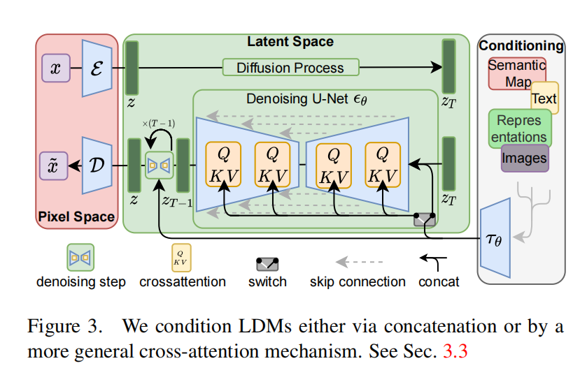
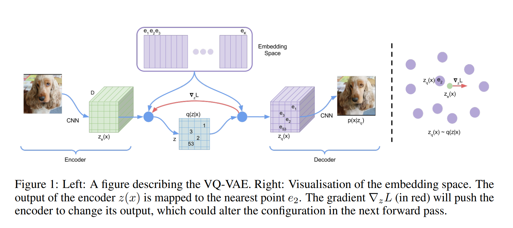
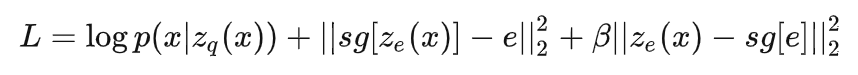
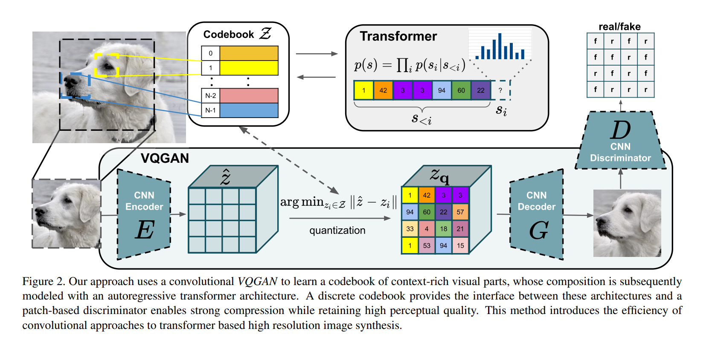
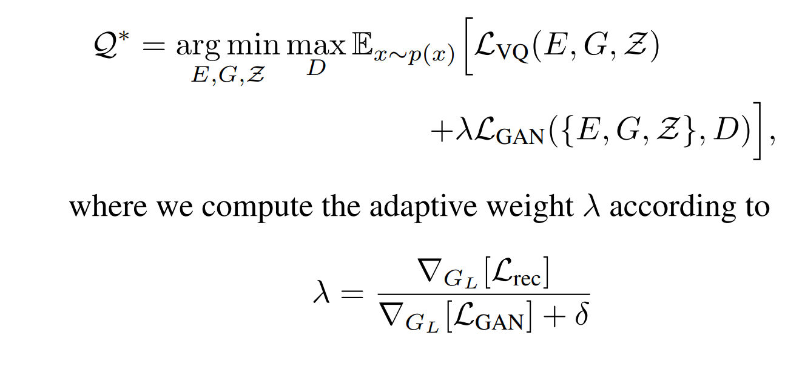
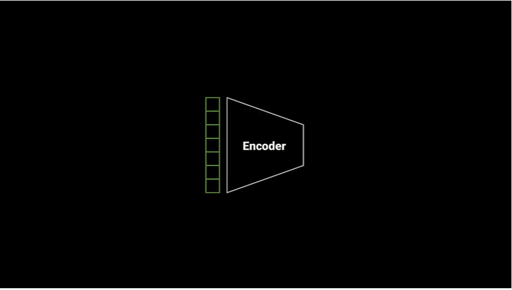

# **High-Resolution Image Synthesis with Latent Diffusion Models**

[[code]](https://github.com/CompVis/latent-diffusion)|[[arXiv]](https://arxiv.org/abs/2112.10752)

## 摘要

通过将图像形成过程分解为去噪自动编码器的顺序应用，扩散模型（``DMs``）在图像数据和其他方面实现了最先进的合成结果。此外，它们的公式允许引导机制控制图像生成过程，而无需重新训练。

然而，由于这些模型通常直接在像素空间中运行，因此强大的 ``DM`` 的优化通常需要数百个 ``GPU`` 天，并且由于顺序评估，推理成本高昂。为了在有限的计算资源上进行 ``DM`` 训练，同时保留其质量和灵活性，我们将它们应用于强大的预训练自动编码器的**潜在空间**。与以前的工作不同，对这种表示进行扩散模型训练首次允许在复杂度减少和细节保留之间达到近乎最优点，极大地提高了视觉保真度。

通过将**交叉注意层**引入模型架构，我们将扩散模型转变为强大且灵活的生成器，用于通用条件输入（如文本或边界框）和高分辨率合成以卷积方式成为可能。我们的潜在扩散模型（``LDMs``）实现了图像修补和类条件图像合成的新的最先进分数，并在各种任务上取得了高度竞争性的表现，包括文本到图像合成、无条件图像生成和超分辨率，同时与基于像素的`` DM`` 相比显著降低了计算要求。

## 主要贡献

- 与纯粹的基于transformer的方法不同，可以更优雅地扩展到更高维度的数据，因此可以
  - 在压缩级别上工作，提供比以前的工作更忠实和详细的重建
  - 可以有效地应用于兆像素图像的**高分辨率**合成。 

- 在多个任务（无条件图像合成、修补、随机超分辨率）和数据集上取得了竞争性的表现，同时显著降低了计算成本。与基于像素的扩散方法相比，我们还显著降低了推理成本。 

- 同时学习**编码器/解码器架构**和基于分数的先验，我们的方法不需要精细地权衡重建和生成能力。这确保了极其忠实的重建，并且对潜在空间的**正则化要求非常少**。 

- 对于密集调节的任务，如超分辨率、修补和语义合成，我们的模型可以以卷积方式应用，并渲染大型、一致的图像，约1024^2 ``pix``。 

- 基于交叉注意力的通用条件机制，实现多模态训练。我们使用它来训练类条件、文本到图像和布局到图像模型。 

## 模型结构

## 感知图像压缩

VQ-VAE 

- 第一项用来训练encoder和decoder，bp时候的梯度直接回传，没有经过embedding，也就是不训练codebook
- 第二项为codebookloss 只训练codebook
- 第三项叫commitment loss, 只训练encoder 

VQ-GAN   [[pdf]](https://openaccess.thecvf.com/content/CVPR2021/papers/Esser_Taming_Transformers_for_High-Resolution_Image_Synthesis_CVPR_2021_paper.pdf)

而VQGAN的整体架构大致是将VQVAE的编码生成器从pixelCNN换成了Transformer

在训练过程中使用PatchGAN的判别器加入对抗损失。以下两节将更详细介绍codebook和Transformer两部分的运作机制。

- **CNN encoder ,CNN decoder ,codebook  train**
  - 
  - $$ \mathcal{L}_{res} = ||x-\hat{x}||^2 $$ 表示 reconstruction loss
  - 

- transformer train
  - 

